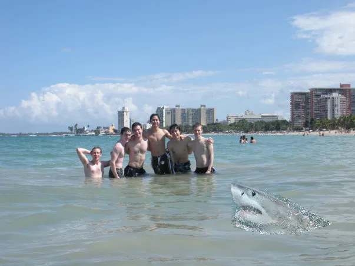

# Assignment 2 - DIP with PyTorch

* **姓名**：宋绪涛
* **学号**：BZ25001005


## 本仓库包含了两个核心实验的实现：

1.  **泊松图像融合**：利用拉普拉斯算子梯度匹配实现无缝图像合成。
2.  **建筑立面翻译 (Pix2Pix)**：使用全卷积网络 (FCN) 实现从语义分割图到真实建筑图像的转换。

## 1\. 实验环境配置

建议使用 Python 3.8+ 和 CUDA 环境以获得最佳性能。

```bash
# 安装核心依赖
pip install torch torchvision numpy opencv-python gradio pillow
```

-----

## 2\. 实验一：泊松图像融合 (Poisson Image Blending)

### 2.1 算法原理

本实验通过最小化目标区域与源区域之间的拉普拉斯算子差异，实现图像的无缝融合。其核心公式为：
$$\min_{f} \iint_{\Omega} |\nabla f - \mathbf{v}|^2 \text{ with } f|_{\partial\Omega} = f^*|_{\partial\Omega}$$
在代码实现中，我们通过迭代优化的方式，使融合区域的拉普拉斯场尽可能接近前景图的拉普拉斯场。

### 2.2 核心功能说明

  * **多边形选取**：支持在交互界面点击选点并闭合多边形区域。
  * **实时偏移调整**：通过 `dx` 和 `dy` 滑块调整前景在背景中的位置。
  * **拉普拉斯损失计算**：使用 `torch.nn.functional.conv2d` 配合 $3 \times 3$ 的拉普拉斯核计算梯度损失。

### 2.3 运行方式

执行以下命令启动 Gradio 交互界面：

```bash
python run_blending_gradio.py
```

-----

## 3\. 实验二：建筑立面翻译 (FCN Facade Translation)

### 3.1 网络架构

采用 **Encoder-Decoder（编码器-解码器）** 结构的全卷积网络（FCN）：

  * **Encoder**：由 4 层卷积层组成，使用步长 (stride=2) 进行下采样，通道数从 3 逐步增加至 512。
  * **Decoder**：由 4 层转置卷积层 (ConvTranspose2d) 组成，逐步恢复空间分辨率。
  * **激活函数**：输出层采用 `Tanh`，将像素值映射至 $[-1, 1]$，以匹配数据集的归一化分布。

### 3.2 训练细节

  * **数据集**：使用 Facades 数据集，输入为 $256 \times 256$ 的语义分割图，目标为对应的 RGB 建筑照片。
  * **损失函数**：使用 $L_1$ Loss（平均绝对误差），相比 $MSE$ 能产生更少的模糊感。
  * **优化器**：Adam 优化器 ($lr=0.001, \beta_1=0.5$)，并配合 `StepLR` 学习率调度器。

### 3.3 训练与评估命令

**开始训练：**

```bash
# 确保当前目录下有 train_list.txt 和 val_list.txt
python train.py
```

  * 训练结果将自动保存至 `train_results/` 文件夹。
  * 模型权重每 50 个 Epoch 保存至 `checkpoints/`。

-----

## 4\. 实验结果展示


## 4.1 泊松融合效果


| 原始前景 | 原始背景 | 融合结果 |
| :---: | :---: | :---: |
|  |  |  |
### 4.2 FCN 翻译效果

模型经过 300 个 Epoch 训练后，能够根据输入的颜色块（语义标签）准确还原出：

  * **窗户 (Windows)** 的排列结构。
  * **墙面 (Walls)** 的基本色调。
  * **阳台与门 (Balcony & Doors)** 的位置。
详细结果见仓库文件
-----

## 5\. 结论与总结

  * **泊松融合** 在处理颜色差异较大的图像时表现优秀，能有效消除“剪贴感”，但需要较多次数的迭代优化。
  * **FCN 网络** 能够学习到跨域的映射关系，虽然结构简单，但已能初步完成建筑生成的任务。


